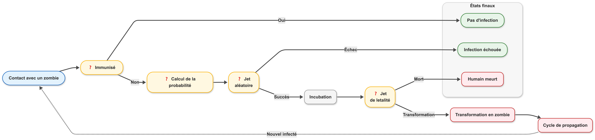

# 🧪 Laboratoire de Virologie Zombie - Mutation Tests Playground

Ce projet est une plateforme de simulation pour étudier la propagation d'un virus zombie dans une population humaine. Il est conçu comme un terrain de jeu pour expérimenter les **Mutation Tests** (avec des outils comme Pitest).



## 🛠 Stack Technique
- **Langage** : Kotlin 2.3.0
- **Framework** : Spring Boot 4.0.1
- **Java** : 25
- **Base de données** : PostgreSQL (gérée par Docker Compose)
- **Migration & Seeding** : Flyway
- **Tests** : JUnit 5, Mockito, AssertJ, Testcontainers

## 🚀 Démarrage rapide

### 1. Renseigner les variables d'environnement
Copier le fichier `.env.example` et renommer le fichier en `.env` pour y ajouter les variables d'environnement nécessaires.

### 2. Lancer la base de données
```bash
docker-compose up -d
```

### 3. Lancer l'application
L'application sera accessible sur `http://localhost:8080`.

## 📡 API Endpoints

### 🟢 Simulation
- `GET /api/simulation/stats` : Récupère les compteurs de population.
- `POST /api/simulation/evolve/{virusId}` : Simule 24h d'évolution (transformations et décès).
- `POST /api/simulation/infect?humanId={id}&virusId={id}` : Tente une infection ciblée.

### 👥 Humains
- `GET /api/humans` : Liste tous les humains.
- `POST /api/humans` : Ajoute un nouveau sujet.

### 🧟 Zombies
- `GET /api/zombies` : Liste tous les zombies.

### 🦠 Virus
- `GET /api/viruses` : Liste les souches connues.
- `POST /api/viruses` : Enregistre un nouveau virus.
- `POST /api/viruses/{id}/mutate` : Génère une variante mutante d'un virus existant.

## 🧬 PIT : Premiers pas

### Qu'est-ce que PIT (Mutation Testing) ?

PIT est un outil de **test par mutation** qui évalue la qualité de vos tests unitaires. Contrairement à la couverture de code classique (qui mesure simplement quelles lignes sont exécutées), PIT introduit des **mutations** (modifications du code) pour vérifier si vos tests détectent ces changements.

**Principe** : Si une mutation du code ne fait pas échouer vos tests, c'est qu'ils ne sont pas assez robustes.

### Installation et configuration

#### 1. Ajouter le plugin PIT dans le `pom.xml`

```xml
<plugin>
    <groupId>org.pitest</groupId>
    <artifactId>pitest-maven</artifactId>
    <version>1.22.0</version>
    <dependencies>
        <dependency>
            <groupId>org.pitest</groupId>
            <artifactId>pitest-junit5-plugin</artifactId>
            <version>1.2.1</version>
        </dependency>
    </dependencies>
    <configuration>
        <targetClasses>
            <param>com.mutation_tests_playground.**.service.*</param>
        </targetClasses>
        <targetTests>
            <param>com.mutation_tests_playground.**</param>
        </targetTests>
    </configuration>
</plugin>
```

#### 2. Paramètres de configuration

- **`targetClasses`** : Classes à tester par mutation
  - `*` : Un seul niveau de package (ex: `com.example.service.*`)
  - `**` : Tous les niveaux de packages (ex: `com.example.**.service.*`)
  - ⚠️ PIT filtre automatiquement le code trop simple (getters, setters, code généré)

- **`targetTests`** : Tests à exécuter
  - `com.mutation_tests_playground.**` : Tous les tests du projet

- **`pitest-junit5-plugin`** : Nécessaire pour JUnit 5 (améliore la détection de couverture)

#### 3. Lancer PIT

```bash
mvn clean test pitest:mutationCoverage
```

Les rapports sont générés dans `target/pit-reports/index.html`.

### Exemple d'analyse : VirusService

#### Code source
```kotlin
/**
 * Crée une mutation d'un virus existant en appliquant un facteur aléatoire :
 * - Taux de transmission : variation de +/- 0.1 maximum
 * - Létalité : variation de +/- 0.05 maximum
 * 
 * Les valeurs globales restent contraintes entre 0.0 et 1.0.
 *
 * @param originalVirus Le virus d'origine.
 * @return Le nouveau virus muté et sauvegardé.
 */
fun createMutation(originalVirus: Virus): Virus {
    val mutationFactor = Random.nextDouble(-0.1, 0.1)

    val mutatedName = "${originalVirus.name} Muté"
    val mutatedTransmissionRate = (originalVirus.transmissionRate + mutationFactor).coerceIn(0.0, 1.0)
    val mutatedLethality = (originalVirus.lethality + (mutationFactor / 2)).coerceIn(0.0, 1.0)
  
    val mutatedVirus = originalVirus.copy(
      id = UUID.randomUUID(),
      name = mutatedName,
      transmissionRate = mutatedTransmissionRate,
      lethality = mutatedLethality
    )

    return virusRepository.save(mutatedVirus)
}
```

#### Tests existants
```kotlin
@Test
fun `should create a mutated virus from original`() {
    val mutated = virusService.createMutation(originalVirus)

    assertThat(mutated.id).isNotEqualTo(originalVirus.id)
    assertThat(mutated.name).contains("Muté")
    verify(virusRepository).save(any())
}

@Test
fun `should respect bounds for transmissionRate and lethality`() {
    val mutated = virusService.createMutation(originalVirus)

    assertThat(mutated.transmissionRate).isBetween(0.0, 1.0)
    assertThat(mutated.lethality).isBetween(0.0, 1.0)
}
```

#### Résultat du rapport PIT

**Mutation Coverage : 0% (0 tuées / 5 mutations)** 🔴

##### ❌ Toutes les mutations ont SURVÉCU (5/5)

| Ligne | Mutation | Impact |
|-------|----------|--------|
| 18, 24 | `removed checkNotNullExpressionValue` × 2 | ✅ Faible (code généré Kotlin) |
| 20 | `addition → subtraction` | 🔴 **CRITIQUE** |
| 21 | `addition → subtraction` | 🔴 **CRITIQUE** |
| 21 | `division → multiplication` | 🔴 **CRITIQUE** |

#### 🎯 Le problème révélé par PIT

##### Mutation 1 : Inversion de l'addition (ligne 20)
```kotlin
// Code original
transmissionRate = (originalVirus.transmissionRate + mutationFactor).coerceIn(0.0, 1.0)

// Code muté (survit !)
transmissionRate = (originalVirus.transmissionRate - mutationFactor).coerceIn(0.0, 1.0)
```

**Pourquoi cette mutation survit ?**
Le test vérifie seulement que `transmissionRate ∈ [0.0, 1.0]`, mais **ne vérifie pas que le calcul est correct** !

Que le code utilise `+` ou `-`, le résultat reste toujours dans `[0.0, 1.0]` grâce à `coerceIn()`.

##### Mutation 2 & 3 : Opérations mathématiques (ligne 21)
```kotlin
// Code original
lethality = (originalVirus.lethality + (mutationFactor / 2)).coerceIn(0.0, 1.0)

// Mutation A : Inversion addition → soustraction
lethality = (originalVirus.lethality - (mutationFactor / 2)).coerceIn(0.0, 1.0)  // ❌ Survit

// Mutation B : Division → multiplication
lethality = (originalVirus.lethality + (mutationFactor * 2)).coerceIn(0.0, 1.0)  // ❌ Survit
```

Même problème : le test vérifie les bornes, pas la formule !

#### 💥 Le diagnostic : Anti-pattern "Tests Cargo Cult"

Vos tests **passent au vert** mais ne testent **aucune logique métier** :

| Ce que les tests vérifient | Ce qu'ils devraient vérifier |
|----------------------------|------------------------------|
| ✅ Le virus est sauvegardé | ✅ ET les formules sont correctes |
| ✅ L'ID change | ✅ ET la mutation augmente/diminue les valeurs |
| ✅ Le nom contient "Muté" | ✅ ET la létalité varie à 50% du taux de transmission |
| ✅ Les valeurs sont dans [0.0, 1.0] | ✅ ET pas juste "valides par chance" |

**C'est exactement ce que PIT détecte : des tests qui donnent une fausse impression de sécurité !**
